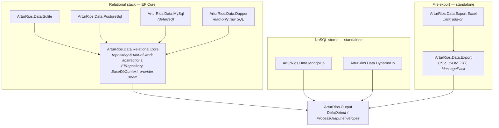
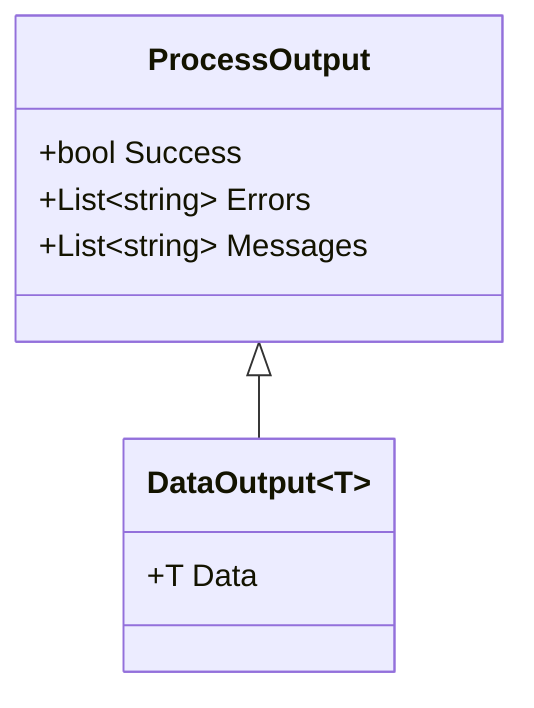
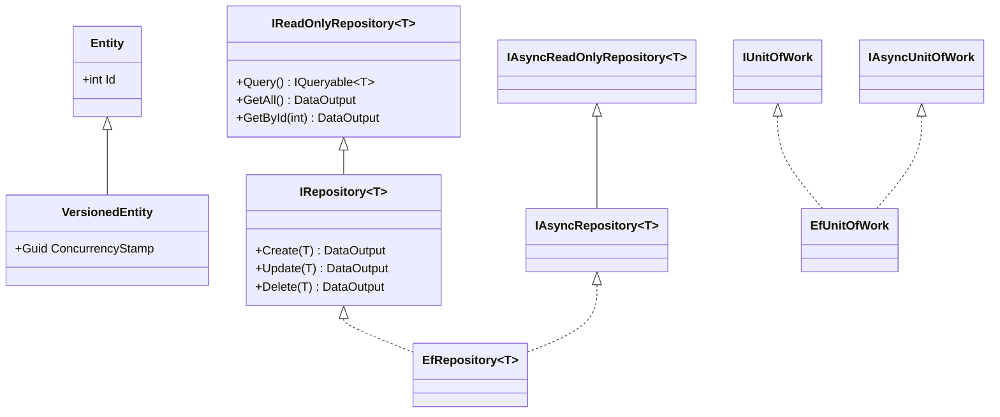

# Dotnet Data

[](https://artur-rios.github.io/dotnet-data)
[](./LICENSE)
[](https://www.nuget.org/packages/ArturRios.Data.Relational.Core)
[](https://www.nuget.org/packages/ArturRios.Data.Sqlite)
[](https://www.nuget.org/packages/ArturRios.Data.PostgreSql)
[](https://www.nuget.org/packages/ArturRios.Data.Dapper)
[](https://www.nuget.org/packages/ArturRios.Data.MongoDb)
[](https://www.nuget.org/packages/ArturRios.Data.DynamoDb)
[](https://www.nuget.org/packages/ArturRios.Data.Export)
[](https://www.nuget.org/packages/ArturRios.Data.Export.Excel)

**`ArturRios.Data`** — a modular data-access toolkit for .NET. One consistent, envelope-based repository
style across **relational** databases (EF Core over PostgreSQL / MySQL / SQLite, plus a Dapper read
path) and **NoSQL** stores (**MongoDB**, **DynamoDB**), plus **file export** writers (CSV, JSON, TXT,
MessagePack, Excel). Every operation returns a
[`DataOutput` / `ProcessOutput`](https://www.nuget.org/packages/ArturRios.Output) envelope, so
infrastructure failures — including optimistic-concurrency conflicts — surface as errors on the result
instead of unhandled exceptions.

- 📚 **Full documentation:** <https://artur-rios.github.io/dotnet-data>
- 🧩 **Architecture & diagrams:** [Architecture](https://artur-rios.github.io/dotnet-data/architecture/)
- 🗄️ **Guides:** [Relational](https://artur-rios.github.io/dotnet-data/relational/) ·
  [MongoDB](https://artur-rios.github.io/dotnet-data/mongodb/) ·
  [DynamoDB](https://artur-rios.github.io/dotnet-data/dynamodb/)

## The package family

Each backend is a separate NuGet package so you install only what you use. The relational packages
share a common core; the NoSQL and export packages are standalone. Everything depends on
`ArturRios.Output` for the result envelopes.



| Package | Backend | Depends on | Status |
|---|---|---|---|
| `ArturRios.Data.Relational.Core` | EF Core abstractions (shared) | `ArturRios.Output`, EF Core | ✅ |
| `ArturRios.Data.Sqlite` | SQLite | Relational.Core | ✅ |
| `ArturRios.Data.PostgreSql` | PostgreSQL (Npgsql) | Relational.Core | ✅ |
| `ArturRios.Data.MySql` | MySQL (Pomelo) | Relational.Core | ⏳ deferred¹ |
| `ArturRios.Data.Dapper` | Raw-SQL reads over the EF connection | Relational.Core, Dapper | ✅ |
| `ArturRios.Data.MongoDb` | MongoDB document store | `ArturRios.Output`, MongoDB.Driver | ✅ |
| `ArturRios.Data.DynamoDb` | AWS DynamoDB | `ArturRios.Output`, AWSSDK.DynamoDBv2 | ✅ |
| `ArturRios.Data.Export` | CSV / JSON / TXT / MessagePack writers | `ArturRios.Output`, MessagePack | ✅ |
| `ArturRios.Data.Export.Excel` | Excel .xlsx export add-on | Export, ClosedXML | ✅ |

¹ Deferred until `Pomelo.EntityFrameworkCore.MySql` publishes an EF Core 10 release (its latest still
targets EF Core 9). Source is written and excluded from the build. See
[Relational → MySQL](https://artur-rios.github.io/dotnet-data/relational/#mysql-status).

## Installation

Install the package(s) for your backend with the [.NET CLI](https://learn.microsoft.com/en-us/dotnet/core/tools/)
(or the NuGet Package Manager in Visual Studio):

```bash
# Relational (EF Core) — the core + a provider matching your engine:
dotnet add package ArturRios.Data.Relational.Core
dotnet add package ArturRios.Data.Sqlite          # or .PostgreSql

# Optional raw-SQL read path (relational):
dotnet add package ArturRios.Data.Dapper

# NoSQL (standalone — no core needed):
dotnet add package ArturRios.Data.MongoDb
dotnet add package ArturRios.Data.DynamoDb

# File export (standalone — no core needed):
dotnet add package ArturRios.Data.Export
dotnet add package ArturRios.Data.Export.Excel    # optional — adds ExportFormat.Excel
```

Requires **.NET 10.0** or later.

## The result envelope

Every read/write method returns a `DataOutput<T>` (data + success/errors) or, for operations with no
payload (deletes, transactions), a `ProcessOutput`. You inspect `Success` / `Data` / `Errors` instead of
catching exceptions.



## Quick start (relational)

**1. Define an entity** (`ArturRios.Data.Relational.Core`):

```csharp
using ArturRios.Data.Relational.Core;

public class Product : Entity          // or : VersionedEntity for optimistic concurrency
{
    public string Name { get; set; } = string.Empty;
    public decimal Price { get; set; }
}
```

**2. Define a context** deriving from `BaseDbContext`:

```csharp
using ArturRios.Data.Relational.Core.Configuration;
using Microsoft.EntityFrameworkCore;

public class AppDbContext(DbContextOptions options) : BaseDbContext(options)
{
    public DbSet<Product> Products => Set<Product>();
}
```

**3. Configure** (`appsettings.json`, default section `"ArturRios.Data.Core"`):

```json
{
  "ArturRios.Data.Core": {
    "DatabaseType": "PostgreSql",
    "ConnectionString": "Host=localhost;Database=mydb;Username=app;Password=secret;"
  }
}
```

**4. Register** the provider + the data layer (`Program.cs`):

```csharp
using ArturRios.Data.PostgreSql;                       // brings AddPostgreSqlProvider()
using ArturRios.Data.Relational.Core.DependencyInjection;

builder.Services.AddPostgreSqlProvider();
builder.Services.AddDataConfig<AppDbContext>(builder.Configuration);
```

**5. Inject and use** the enveloped repository / unit of work:

```csharp
using ArturRios.Data.Relational.Core.Interfaces;
using ArturRios.Data.Relational.Core.Transactions;
using ArturRios.Output;

public class ProductService(IAsyncRepository<Product> repo, IAsyncUnitOfWork unitOfWork)
{
    public async Task<int> CreateAsync(Product p)
    {
        DataOutput<int> result = await repo.CreateAsync(p);
        return result.Success ? result.Data : throw new InvalidOperationException(string.Join(", ", result.Errors));
    }

    public Task<DataOutput<int>> CreateTwoAtomicallyAsync(Product a, Product b) =>
        unitOfWork.ExecuteInTransactionAsync(async () =>
        {
            var first = await repo.CreateAsync(a);
            await repo.CreateAsync(b);
            return first.Data;
        });
}
```

The full relational guide (providers, sync + async interfaces, the `Query()` escape hatch, concurrency,
transactions, and the Dapper read path) is at
**[Relational](https://artur-rios.github.io/dotnet-data/relational/)**.

### Relational repository model



## NoSQL, at a glance

The NoSQL packages are **standalone** (no relational core) but keep the same enveloped style.

- **MongoDB** — a document repository (`IAsyncDocumentRepository<T>`) with `Document` / `VersionedDocument`
  identity, `Find(predicate)` server-side filtering, a `Query()` LINQ escape hatch, opt-in optimistic
  concurrency, and multi-document transactions (`IMongoUnitOfWork`, requires a replica set).
  → **[MongoDB guide](https://artur-rios.github.io/dotnet-data/mongodb/)**
- **DynamoDB** — an async-only repository (`IAsyncDynamoRepository<T>`) over the AWS object-persistence
  model with POCO-attribute keys, `[DynamoDBVersion]` optimistic concurrency, Query/Scan/batch, and a
  `ServiceUrl` for DynamoDB Local / LocalStack.
  → **[DynamoDB guide](https://artur-rios.github.io/dotnet-data/dynamodb/)**

## Documentation

| Page | What's there |
|---|---|
| [Architecture](https://artur-rios.github.io/dotnet-data/architecture/) | Package diagram, class diagrams, the envelope model, design principles |
| [Relational](https://artur-rios.github.io/dotnet-data/relational/) | EF Core setup, providers, repositories, unit of work, concurrency, Dapper |
| [MongoDB](https://artur-rios.github.io/dotnet-data/mongodb/) | Documents, repository, transactions, concurrency |
| [DynamoDB](https://artur-rios.github.io/dotnet-data/dynamodb/) | Item POCOs, repository, query/scan/batch, concurrency |

## Versioning

Semantic Versioning (SemVer). Breaking changes bump the major version; new non-breaking behavior bumps
the minor; fixes bump the patch.

## Build, test and publish

Use the official [.NET CLI](https://learn.microsoft.com/en-us/dotnet/core/tools/) to build, test and
publish, and Git for source control. Optional helper toolsets:
[Dotnet Tools](https://github.com/artur-rios/dotnet-tools) ·
[Python Dotnet Tools](https://github.com/artur-rios/python-dotnet-tools).

## Legal

Licensed under the [MIT License](https://en.wikipedia.org/wiki/MIT_License) — see [LICENSE](./LICENSE).
