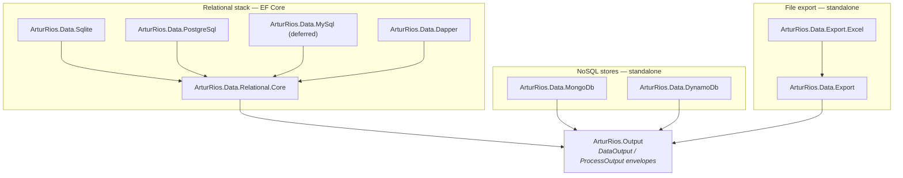
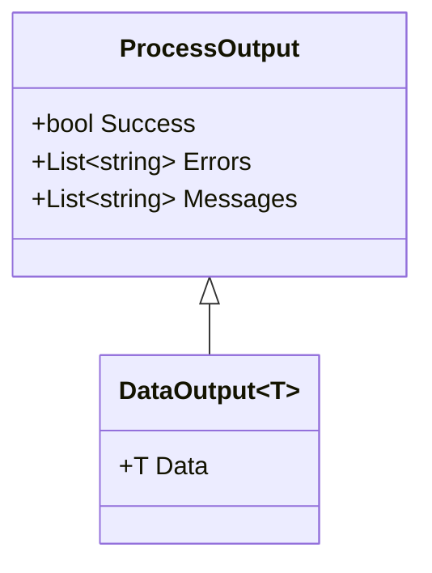

+++
title = 'Dotnet Data'
+++

# Dotnet Data

**`ArturRios.Data`** is a modular data-access toolkit for .NET. It gives you one consistent,
envelope-based repository style across **relational** databases (EF Core over PostgreSQL / MySQL /
SQLite, plus a Dapper read path) and **NoSQL** stores (**MongoDB**, **DynamoDB**), plus **file export**
writers (CSV, JSON, TXT, MessagePack, Excel).

Every read/write operation returns a [`DataOutput` / `ProcessOutput`](https://www.nuget.org/packages/ArturRios.Output)
envelope, so infrastructure failures — including optimistic-concurrency conflicts — surface as errors
on the result rather than as unhandled exceptions.

## The package family

Each backend is a separate NuGet package, so you install only what you use. The relational packages
share a common core; the NoSQL and export packages are standalone. Everything depends on
`ArturRios.Output` for the envelopes.



| Package | Backend | Status |
|---|---|---|
| `ArturRios.Data.Relational.Core` | EF Core abstractions (shared) | Available |
| `ArturRios.Data.Sqlite` | SQLite | Available |
| `ArturRios.Data.PostgreSql` | PostgreSQL | Available |
| `ArturRios.Data.MySql` | MySQL | Deferred (waiting on a Pomelo EF Core 10 release) |
| `ArturRios.Data.Dapper` | Raw-SQL reads over the EF connection | Available |
| `ArturRios.Data.MongoDb` | MongoDB document store | Available |
| `ArturRios.Data.DynamoDb` | AWS DynamoDB | Available |
| `ArturRios.Data.Export` | CSV / JSON / TXT / MessagePack writers | Available |
| `ArturRios.Data.Export.Excel` | Excel .xlsx export add-on | Available |

## Installation

Requires **.NET 10.0** or later. Install the package(s) for your backend:

```bash
# Relational (EF Core) — the core + a provider matching your engine:
dotnet add package ArturRios.Data.Relational.Core
dotnet add package ArturRios.Data.Sqlite          # or .PostgreSql

# Optional raw-SQL read path (relational):
dotnet add package ArturRios.Data.Dapper

# NoSQL (standalone — no core needed):
dotnet add package ArturRios.Data.MongoDb
dotnet add package ArturRios.Data.DynamoDb

# File export (standalone — no core needed):
dotnet add package ArturRios.Data.Export
dotnet add package ArturRios.Data.Export.Excel    # optional — adds ExportFormat.Excel
```

## The result envelope

All operations return a `DataOutput<T>` (data + success/errors) or, for operations with no payload
(deletes, transactions), a `ProcessOutput`. Inspect `Success` / `Data` / `Errors` instead of catching
exceptions.



## Where to next

- **[Architecture](/architecture/)** — package diagram, class diagrams, the envelope model, and the
  design principles (modular packaging, envelopes-not-exceptions, the provider seam).
- **[Relational](/relational/)** — EF Core setup, provider packages, sync + async repositories, the
  unit of work, optimistic concurrency, and the Dapper read path.
- **[MongoDB](/mongodb/)** — document identity, the document repository, server-side `Find`, the LINQ
  `Query()` escape hatch, transactions, and concurrency.
- **[DynamoDB](/dynamodb/)** — item POCOs and keys, the async repository, Query/Scan/batch, and
  `[DynamoDBVersion]` concurrency.
- **[Export](/export/)** — the exporter factory, the CSV/JSON/TXT/MessagePack/Excel formats, the column
  map and its attributes, and the options.

The source lives at [github.com/artur-rios/dotnet-data](https://github.com/artur-rios/dotnet-data),
licensed under the MIT License.
