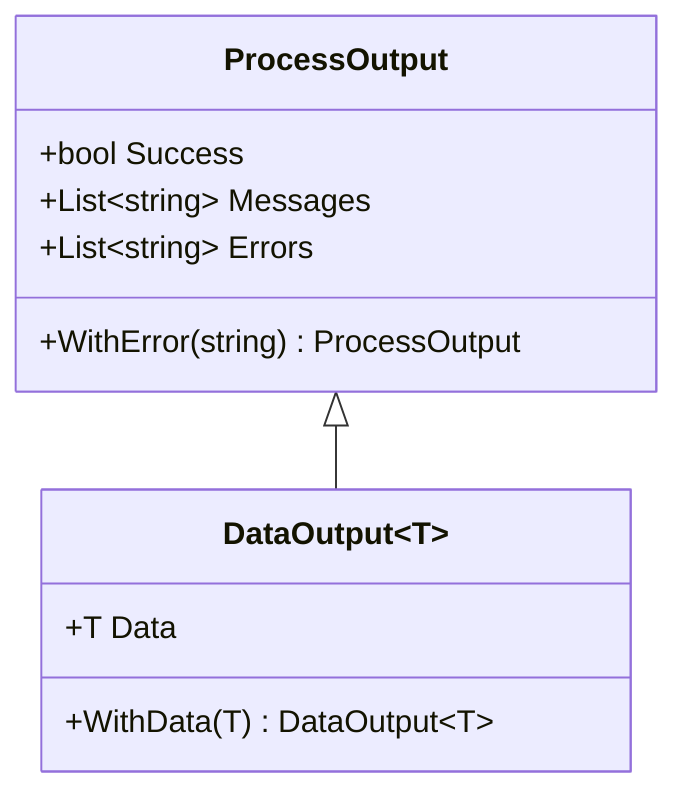
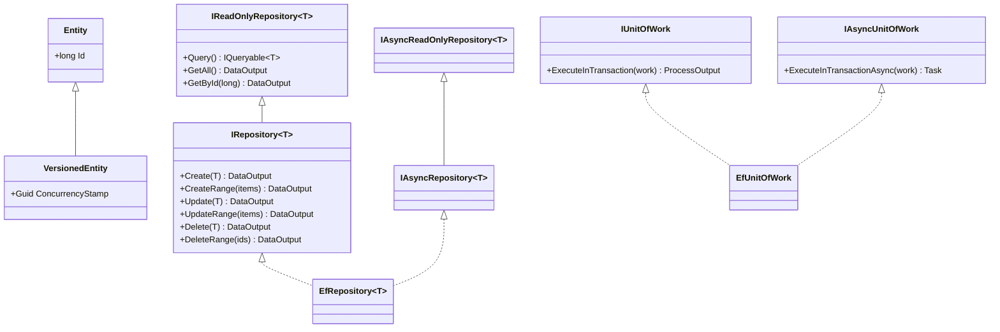
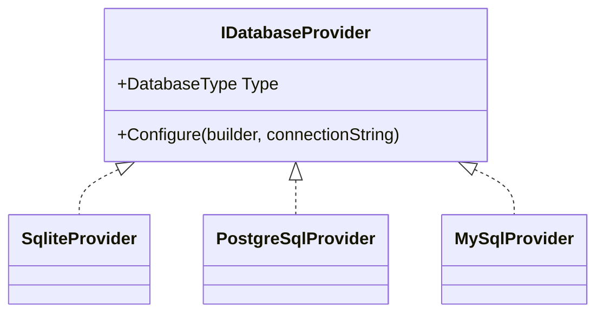
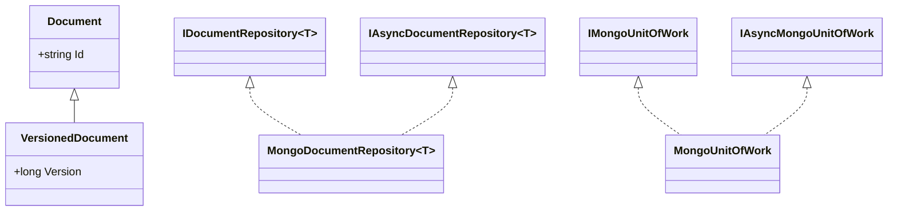
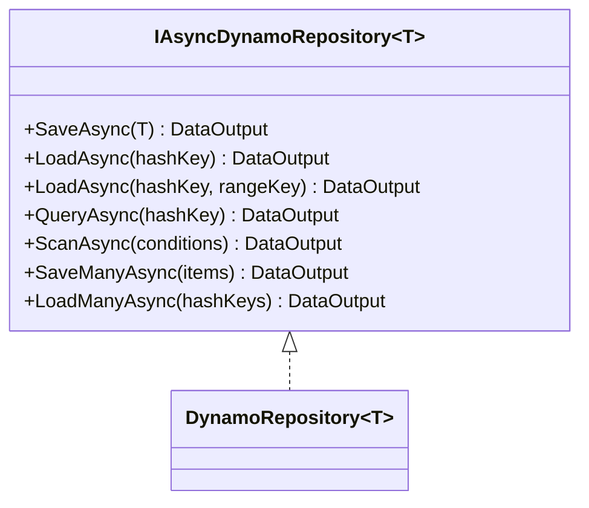
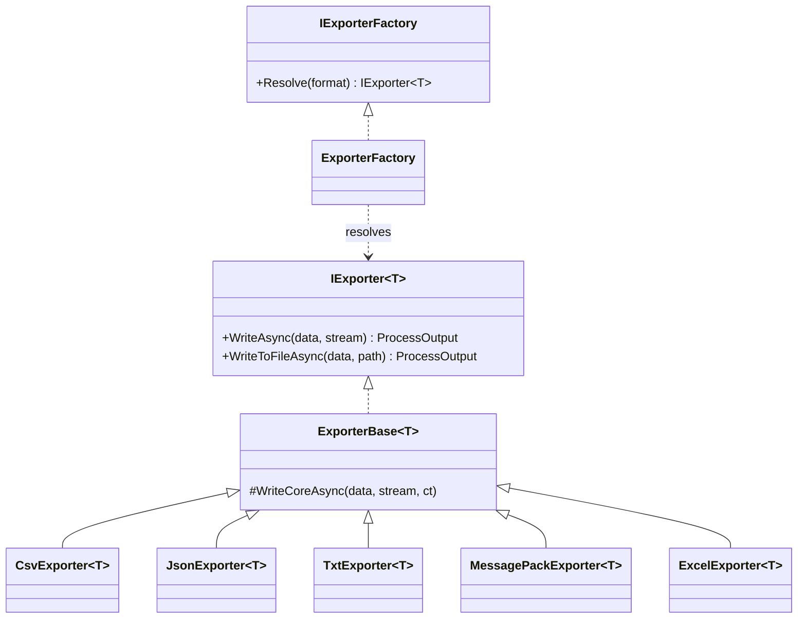

+++
title = 'Architecture'
+++

# Architecture

`ArturRios.Data` is a family of small, focused NuGet packages. This page shows how they fit together,
the key types in each, and the design principles they share.

## Package dependencies

```mermaid
flowchart TB
    Output["ArturRios.Output<br/><i>DataOutput / ProcessOutput envelopes</i>"]

    subgraph Relational["Relational stack — EF Core"]
        direction TB
        Core["ArturRios.Data.Relational.Core<br/><i>interfaces, EfRepository, EfUnitOfWork,<br/>BaseDbContext, IDatabaseProvider seam</i>"]
        Sqlite["ArturRios.Data.Sqlite<br/><i>AddSqliteProvider()</i>"]
        Postgres["ArturRios.Data.PostgreSql<br/><i>AddPostgreSqlProvider()</i>"]
        MySql["ArturRios.Data.MySql<br/><i>(deferred)</i>"]
        Dapper["ArturRios.Data.Dapper<br/><i>read-only raw SQL</i>"]
    end

    subgraph NoSQL["NoSQL stores — standalone"]
        direction TB
        Mongo["ArturRios.Data.MongoDb<br/><i>document repository + transactions</i>"]
        Dynamo["ArturRios.Data.DynamoDb<br/><i>async repository over IDynamoDBContext</i>"]
    end

    subgraph Export["File export — standalone"]
        direction TB
        ExportCore["ArturRios.Data.Export<br/><i>exporter factory, column map,<br/>CSV / JSON / TXT / MessagePack</i>"]
        ExportExcel["ArturRios.Data.Export.Excel<br/><i>.xlsx add-on</i>"]
    end

    Sqlite --> Core
    Postgres --> Core
    MySql --> Core
    Dapper --> Core
    Core --> Output
    Mongo --> Output
    Dynamo --> Output
    ExportExcel --> ExportCore
    ExportCore --> Output

    EF["Microsoft.EntityFrameworkCore"]:::ext
    EfProviders["Npgsql / Pomelo / Sqlite EF provider"]:::ext
    DapperLib["Dapper"]:::ext
    MongoLib["MongoDB.Driver"]:::ext
    Aws["AWSSDK.DynamoDBv2"]:::ext
    MsgPack["MessagePack"]:::ext
    ClosedXml["ClosedXML"]:::ext
    Core --> EF
    Sqlite --> EfProviders
    Postgres --> EfProviders
    MySql --> EfProviders
    Dapper --> DapperLib
    Mongo --> MongoLib
    Dynamo --> Aws
    ExportCore --> MsgPack
    ExportExcel --> ClosedXml

    classDef ext fill:#8882,stroke-dasharray:3 3;
```

**The families are deliberately separate.** The relational providers and the Dapper read path build
on `ArturRios.Data.Relational.Core` (EF Core). The NoSQL packages do **not** depend on the relational
core — pulling EF Core into a MongoDB or DynamoDB app would be wasteful — so they depend only on
`ArturRios.Output` and their native driver. MongoDB and DynamoDB are also separate from each other: their
data models diverge too much (composite keys and a key/scan access model in DynamoDB vs. documents with
LINQ/predicate queries in MongoDB) to share one interface without becoming leaky. The export packages
are independent of all of it — they take any `IEnumerable<T>`, so they need no store at all.

**Excel is split out** for the same reason, one level down: ClosedXML is a heavy dependency, so it lives
in an add-on that apps opt into. The core keeps no compile-time reference to it — the add-on registers a
marker type that the exporter factory resolves at runtime.

## The result envelope

Every backend returns the same envelope types from `ArturRios.Output`. A `ProcessOutput` carries success
state, error messages, and info messages; `DataOutput<T>` adds a typed payload.

## Relational model

The relational core exposes four repository interfaces (a read-only tier and a full read/write tier,
each in a sync and an async flavour), all constrained to `T : Entity`. `EfRepository<T>` implements all
four; `EfUnitOfWork` implements both unit-of-work interfaces. Consumers derive their entities from
`Entity` (or `VersionedEntity` for optimistic concurrency) and their `DbContext` from `BaseDbContext`.

### The provider seam

The core never references a specific EF provider. Each provider package implements `IDatabaseProvider`
and registers it as a singleton, exposing which `DatabaseType` it handles; `AddDataConfig<TContext>`
reads the configured `DatabaseType` and picks the matching provider out of the registered set to
configure the `DbContext`. This is why you call both `AddXProvider()` and `AddDataConfig<TContext>()`.

Registration validates this eagerly: if it can prove no registered provider matches the configured
`DatabaseType`, it throws a `DataAccessException` naming the missing package rather than failing on the
first query.

## MongoDB model

MongoDB uses a distinct interface family (`IDocumentRepository<T>` / `IAsyncDocumentRepository<T>` plus
read-only tiers) with string/`ObjectId` identity. `MongoDocumentRepository<T>` implements them over a
`MongoContext` that carries the ambient session used by `MongoUnitOfWork` transactions.

## DynamoDB model

DynamoDB has no shared base class — items are plain POCOs annotated with AWS attributes. The single
async repository interface maps to DynamoDB's real access model (key-based load, partition-key query,
scan, batch).

## Export model

Export has no store and no entity base class — it takes any `IEnumerable<T>`. `IExporter<T>` is the one
contract; `ExporterBase<T>` centralizes the null-guarding, envelope conversion, and stream lifetime, so
a concrete exporter only implements the format-specific write. `IExporterFactory` maps an
`ExportFormat` to the right exporter out of the container.

The columnar formats (CSV, Excel) share one `ColumnMap`, which compiles and caches a per-type column
plan from the record's public properties, honouring `[ExportColumn]` and `[ExportIgnore]`.

## Design principles

- **Modular packaging.** One package per backend; install only what you use. NoSQL packages don't drag
  in EF Core.
- **Envelopes, not exceptions.** Every public repository/unit-of-work method catches infrastructure
  exceptions and returns them as `DataOutput`/`ProcessOutput` errors. Optimistic-concurrency conflicts
  become a friendly "concurrency conflict" error. The one intentional exception is
  `OperationCanceledException`, which propagates so cooperative cancellation stays idiomatic.
- **Opt-in optimistic concurrency.** Derive from `VersionedEntity` / `VersionedDocument`, or add
  `[DynamoDBVersion]`, to get conditional writes; without it, writes are last-writer-wins.
- **Transactions where the engine supports them.** Relational and MongoDB expose a delegate-based unit
  of work; the Dapper read path enlists in the relational transaction. (DynamoDB transactions are a
  planned addition.)
- **Consistent naming.** `AddDataConfig` / `AddMongoData` / `AddDynamoData` / `AddExport` for DI;
  `DataOutput<T>` / `ProcessOutput` everywhere; `Async` suffix + `CancellationToken` on async members.

See the [Relational](/dotnet-data/relational), [MongoDB](/dotnet-data/mongodb), [DynamoDB](/dotnet-data/dynamodb), and
[Export](/dotnet-data/export) guides for full usage.
